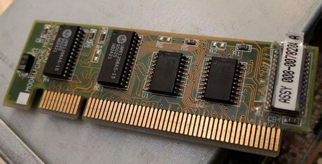
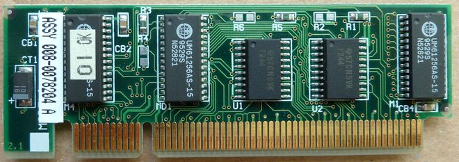
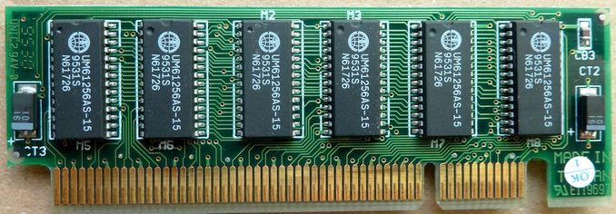
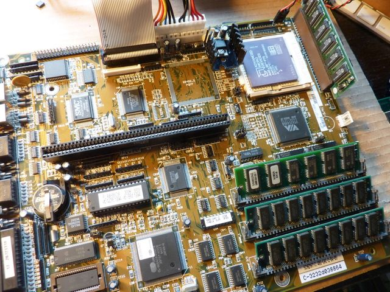

# FIC-486-GAC-2 Cache Module reproduction
 

Reverse Engineered non standard 256K L2 Cache Module for use in:

- AT&T GLOBALYST 510 = NCR 3228 = [FIC 486-GAC-2](https://theretroweb.com/motherboards/s/fic-486-gac-2)
- AT&T GLOBALYST 515 = NCR 3232 = [FIC 486-GAC-2](https://theretroweb.com/motherboards/s/fic-486-gac-2)

Potentially also:
- AT&T Globalyst 520 = NCR 3238 = FIC 486-PAK-3 needs confirmation
- NCR 3231 ?
- AT&T Globalyst 525 = NCR 3253 ?

**Incompatible** platforms also reusing VLB slot for Cache:
- AT&T
  - [Globalyst 550 = NCR 3246](https://theretroweb.com/motherboards/s/atandt,-inc.-at-and-t,-inc.-globalyst-550-c) 
  - Globalyst 575 = NCR 3347 both use [517-0002811](/not%20compatible%20proprietary%20vlb%20cache%20modules/ATT-Globalyst_550_575.jpg)
- [Olivetti M4 454 S](https://theretroweb.com/motherboards/s/olivetti-m4-4x4) uses 128KB CYM9236 [front](/not%20compatible%20proprietary%20vlb%20cache%20modules/CYM9236.jpg?raw=true) [back](/not%20compatible%20proprietary%20vlb%20cache%20modules/CYM9236%20back.jpg?raw=true) [front with slot](/not%20compatible%20proprietary%20vlb%20cache%20modules/CYM9236%20and%20slot.jpg?raw=true) and 256KB CYM9237
- [Siemens Nixdorf FD200 D882](https://theretroweb.com/motherboards/s/siemens-nixdorf-system-board-d882) uses 256KB cym9252pb [front](/not%20compatible%20proprietary%20vlb%20cache%20modules/Siemens%20Nixdorf%20FD200%20D882%20cym9252pb.JPG?raw=true) [back](/not%20compatible%20proprietary%20vlb%20cache%20modules/Siemens%20Nixdorf%20FD200%20D882%20cym9252pb%20back.JPG?raw=true) and unknown 128KB one.
- [HP Vectra VE 4](https://theretroweb.com/motherboards/s/hp-vectra-ve-4-xxx-d3501) uses 256KB HP D2465A/IDT 7MP6190 [front](/not%20compatible%20proprietary%20vlb%20cache%20modules/HP%20Vectra%20VE%204%20256%20KB%20Cache%20D2465A.webp?raw=true) [back](/not%20compatible%20proprietary%20vlb%20cache%20modules/HP%20Vectra%20VE%204%20256%20KB%20Cache%20D2465A%20back.webp?raw=true)
- [HPE NetServer LC 5/166 (D4861AR)](https://theretroweb.com/motherboards/s/hp-netserver-lc) uses 256KB HP D3322A/IDT 7MP6190 (HP 0960-0899) [front](/not%20compatible%20proprietary%20vlb%20cache%20modules/7MP6152.jpg?raw=true)
- Compaq
  - [ProLinea 4/66 (164560-001)](https://theretroweb.com/motherboards/s/compaq-prolinea-4-66)
  - [Presario 833CDS/850/850CDS/860CDS/866 (197023-001)](https://theretroweb.com/motherboards/s/compaq-presario-800)
  - [Presario 700-900 series](https://theretroweb.com/motherboards/s/compaq-presario-700-900-series-486) all three use 128KB 197005-001 [front](/not%20compatible%20proprietary%20vlb%20cache%20modules/Compaq%20197005-001.jpg?raw=true) [back](/not%20compatible%20proprietary%20vlb%20cache%20modules/Compaq%20197005-001%20back.jpg?raw=true)
  - [Prosignia VS](https://www.digitaldungeon.be/digitaldungeon/computer/compaq/prosignia-vs_01/prosignia-vs_01.html) uses Sony CXK784862Q-33 based 256KB Compaq 194380-001 [front](/not%20compatible%20proprietary%20vlb%20cache%20modules/Compaq%20194380-001.jpg?raw=true) [back](/not%20compatible%20proprietary%20vlb%20cache%20modules/Compaq%20194380-001%20back.jpg?raw=true)
  - [Deskpro/i Family 3](https://theretroweb.com/motherboards/s/compaq-deskpro-i-family-3-25i-rev-1-p-n-002) uses Intel A82485-33 based 64KB 141345-001 (002581)
  - [Deskpro/i Family 4](https://theretroweb.com/motherboards/s/compaq-deskpro-i-family-4-25is-rev-3-p-n-00) uses Intel A82485-33 based 64KB 141477-001 (002754) [front](/not%20compatible%20proprietary%20vlb%20cache%20modules/Compaq%20002754-001.jpg?raw=true) [back](/not%20compatible%20proprietary%20vlb%20cache%20modules/Compaq%20002754-001%20back.jpg?raw=true)
# Resources
Original DOC: 13630 ASSY: 008-0078204 A Cache module:

rev 2 [front ](/DOC13630.jpg?raw=true)

rev 2.1 [front ](/P1220276.JPG?raw=true), [back ](/P1220275.JPG?raw=true)

[plugged into FIC 486-GAC-2](/P1220281.JPG?raw=true)

-----
Vogons [FIC 486-GAC-2 and proprietary cache module](https://www.vogons.org/viewtopic.php?f=46&t=94550) thread:
>majestyk: "FIC sold two different versions with different pinouts (and the same "VLB"-socket). Only the one in the pictures works on a 486-GAC2 and a few other FIC mainboards."

This project was only possible with help provided by majestyk - owner of this very rare Cache module, and RockstarRunner - FIC 486-GAC-2 owner looking for said Cache module. Huge thanks for taking time to capture high resolution pictures and validating progress with measurements.

[UMC UM61256A 32K x 8 Static RAM datasheet](/UMC_UM61256A.pdf)

[VESA VLB slot pinout](/VLB_pins.png) [VESA VLB slot dimensions](/vlb-edge-conn.png)

# Progress report

3/23/2024: [Final Rev 2.4](/FIC%20486-GAC-2%20cache%20Final%20rev2.4.png). Reworked SRAM footprint for easier hand soldering, slightly optimized capacitor placement.

2/29/2024: [Final Rev 2.3](/FIC%20486-GAC-2%20cache%20Final%20rev2.3.png). Slightly thicker tracks and silkscreen text, additional clearance work. Shrank from initial prototype, should be almost the height of original. Height when inserted 26.3mm, height including slot 33.6mm. 

2/28/2024: Prototypes assembled, didnt work at first try. Turns out I swapped few power/ground pins in the connector resulting in dead short. Great sleuthing by miisalo uncovered thia mishap, after cutting bad connections we have sucessfull boot.

2/27/2024: Prototypes arrived. Who can spot the problem?

 

Will require some finessing with sandpaper to uncover edge slot pads :)

2/11/2024: [99% done](/FIC%20486-GAC-2%20cache%20coast%20VIP%2099%25.png), ERC&DRC 0 errors 0 warnings. Footprints should be correct now. Gerbers sent for manufacturing.

2/8/2024: [95% there](/FIC%20486-GAC-2%20cache%20coast%20VIP%2095%25.png), 0 errors, 7 Warnings. 5 connections missing, 11 guesses and assumptions on U1 U2 and some more on common lines.

2/6/2024: [90% there](/FIC%20486-GAC-2%20cache%20coast%20VIP%2090%25.png), 0 errors 18 warnings. Just a couple tracks left.

2/5/2024: [80% there](/FIC%20486-GAC-2%20cache%20coast%20VIP%2080%25.png), 0 drc errors, 62 violations. Still bad footprints and I havent gotten around to fixing power/ground pins. Whats left is figuring LS244 address buffering mapping, TAG ram address and output pins to edge mapping, WE/CE/OE mapping to edge.

2/4/2024: Very VIP, only about 50% there at the moment.

02/3/2024: Project start. Figuring out how to make edge connector footprint, searching for SOJ-28L footprint.
